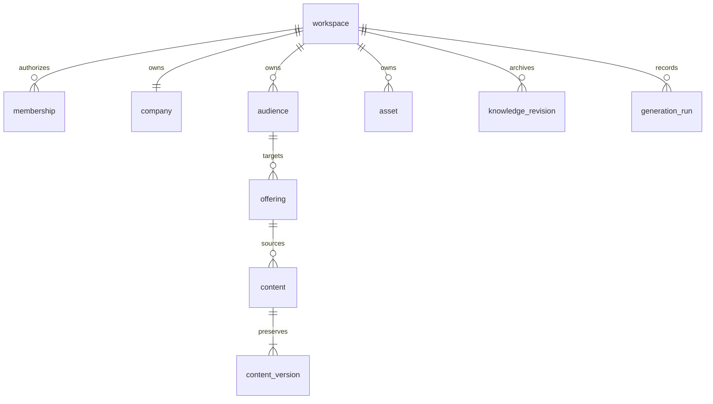

# 구현 결정 — P0

최상위 기준은 변경하지 않은 Master_Development_Specification.md입니다.

- Next.js/React + TypeScript + PostgreSQL. 기본 제공 Sites Worker 환경은 PostgreSQL TCP/Node 라이브러리 제약이 있어, 명세의 스택을 유지하는 **Node 실행 및 로컬 검토용 패키지**로 구현합니다. 공개 배포하지 않습니다.
- 인증은 Better Auth + Drizzle 어댑터. 데이터 접근은 모든 서버 엔드포인트에서 membership을 확인합니다.
- PostgreSQL 서버 자격 증명 없이 테스트할 때만 서버측 PGlite(WASM PostgreSQL) 디스크 저장을 사용합니다. 운영에서는 DATABASE_URL과 S3 호환 객체 저장소를 필수로 요구합니다.
- 회사/브랜드, 제품 기능/혜택/근거/가격은 JSONB 집합으로 저장하되 Zod로 구조를 검사합니다. 고객군·제품·자산·콘텐츠는 독립 엔터티입니다. 제품과 고객군, 콘텐츠와 원천 자료는 복합 외래키로 같은 Workspace를 강제합니다.
- 이전 Python 시제품의 사실 기반 fallback 원칙을 TypeScript로 이식합니다. 이미지·영상 렌더링은 명세 P1에 보류합니다.
- 유료 AI 호출은 기본 꺼짐. 별도 승인과 키 연결 전에는 사실 재구성 모드만 사용합니다. 기본 모드의 번역은 사용자가 등록한 언어별 문구를 사용하고, 없으면 원문 보존과 번역 누락을 표시합니다.

핵심 화면 흐름: 로그인 → 작업공간 생성 → 고객군 → 제품과 근거 → 목적별 생성 → 근거 검토 → 버전 저장/내보내기.
